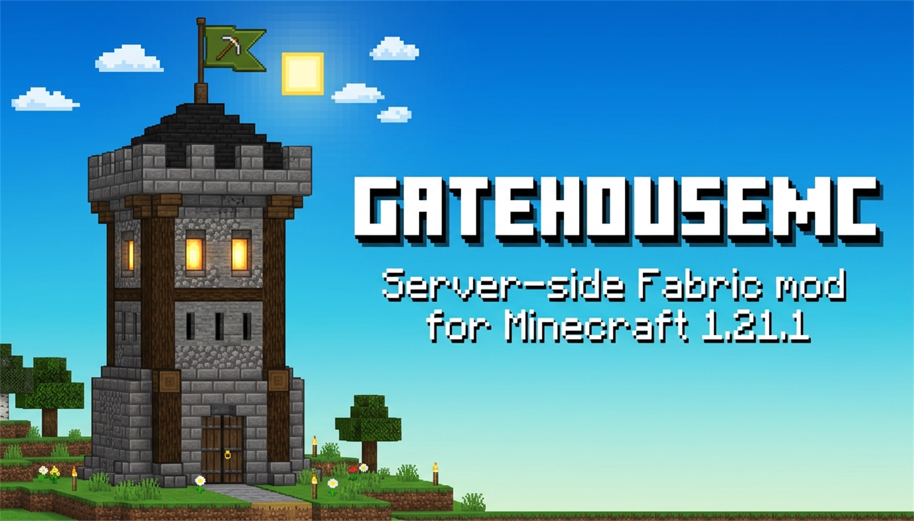

<p align="center">
  
</p>

# GatehouseMC

<p align="center">
  <a href="https://github.com/DurdeuVlad/GatehouseMC/releases"></a>
  <a href="https://modrinth.com/mod/gatehousemc"></a>
  <a href="https://www.curseforge.com/minecraft/mc-mods/gatehousemc"></a>
  
  
  
  
</p>

Server-side Fabric mod for Minecraft 1.21.1. When vanilla rejects an offline-mode player because they are not whitelisted, GatehouseMC records one durable request and exposes approve/deny/block/undo actions through `/gatehouse` (aliases `/gh`, `/wlreq`), Discord, and Telegram adapters.

GatehouseMC is an operational workflow layer around Minecraft's native whitelist. It does not authenticate players, replace `whitelist.json`, retain IP addresses, or require a client mod.

## Requirements

- Minecraft Java Edition 1.21.1
- Fabric Loader 0.19.5 and a compatible Fabric API
- Java 21
- `online-mode=false` and `white-list=true` for the supported offline-mode workflow

## Downloads & Distribution

- **Modrinth:** [modrinth.com/mod/gatehousemc](https://modrinth.com/mod/gatehousemc) *(see [Modrinth Description](docs/publishing/MODRINTH.md))*
- **CurseForge:** [curseforge.com/minecraft/mc-mods/gatehousemc](https://www.curseforge.com/minecraft/mc-mods/gatehousemc) *(see [CurseForge Description](docs/publishing/CURSEFORGE.md))*
- **GitHub Releases:** [github.com/DurdeuVlad/GatehouseMC/releases](https://github.com/DurdeuVlad/GatehouseMC/releases)
- **Operator Publishing Guide:** [`docs/PUBLISHING.md`](docs/PUBLISHING.md)

## Build

```text
./gradlew clean test build
```

On Windows PowerShell:

```powershell
.\gradlew.ps1 clean test build
```

The production artifact is written to `build/libs/gatehousemc-1.0.2.jar`. The build nests SQLite and JDA so the jar can be installed on a clean Fabric server without external dependency mods.

## Real-server smoke test

The headless client driver lives in `tools/e2e/` and requires Node.js 20+:

```powershell
Push-Location tools/e2e
npm ci
npm run smoke
Pop-Location
```

The default assertion expects an unwhitelisted offline client to be rejected.
After approving a request on the server, run the join assertion with
`$env:MC_EXPECTED_STATUS = 'joined'`. The complete release matrix, including a
clean standalone server and restart/outage scenarios, is documented in
[`docs/TESTING.md`](docs/TESTING.md).

## Install and configure

Put `gatehousemc-1.0.2.jar` in the server's `mods/` directory and start the server once. GatehouseMC creates:

```text
config/gatehousemc/config.json
config/gatehousemc/requests.sqlite
```

> [!NOTE]
> Existing deployments using legacy `config/whitelistrequest/` are automatically migrated on startup to `config/gatehousemc/`.

Minecraft commands are always available after the server starts:

```text
/gatehouse list [pending|approved|denied|blocked]
/gatehouse show <request-id|username>
/gatehouse approve <request-id|username> [reason...]
/gatehouse deny <request-id|username> [reason...]
/gatehouse block <request-id|username> [reason...]
/gatehouse unblock <username> [reason...]
/gatehouse undo <request-id|username> [reason...]
/gatehouse status
/gatehouse reload
```

*(Commands also respond to `/gh` and `/wlreq` aliases).*

Discord and Telegram are disabled by default. Enable them only after setting stable administrator IDs and provider secrets. Secrets can use `${DISCORD_TOKEN}` and `${TELEGRAM_BOT_TOKEN}`; expanded values stay in memory and are never written back or included in status output.

Discord normally publishes to a guild text channel:

```json
"discord": {
  "enabled": true,
  "token": "${DISCORD_TOKEN}",
  "guildId": "<guild snowflake>",
  "channelId": "<channel snowflake>",
  "dmUserId": "",
  "allowedUserIds": ["<administrator snowflake>"],
  "allowedRoleIds": []
}
```

For a private destination, set `dmUserId` to the administrator's Discord user ID, include that same ID in `allowedUserIds`, and leave `channelId` blank. Discord may still reject bot DMs because of mutual-guild or recipient privacy rules; a private test guild channel is the reliable isolated alternative.

## Trust warning

Raw offline mode does not verify ownership of a Minecraft name. Approving `Alice` grants access to the offline profile derived from the supplied name; it does not prove that a particular Microsoft/Mojang account owns that identity.

## Verification status

The 1.0.2 release gate requires the unit/component suite, a clean packaged-jar Fabric 1.21.1 server boot, offline rejection/persistence/deduplication, Discord publication, approval, vanilla whitelist mutation, reconnect, and restart checks. Results are recorded in the release PR and `docs/TESTING.md`; an unexecuted scenario is not treated as passing.

See [`CONTRIBUTING.md`](CONTRIBUTING.md), [`WHITELIST_REQUEST_SPEC.md`](WHITELIST_REQUEST_SPEC.md), [`docs/HANDOFF.md`](docs/HANDOFF.md), [`docs/OSS.md`](docs/OSS.md), and [`docs/PUBLISHING.md`](docs/PUBLISHING.md) for project policy and release procedures.
